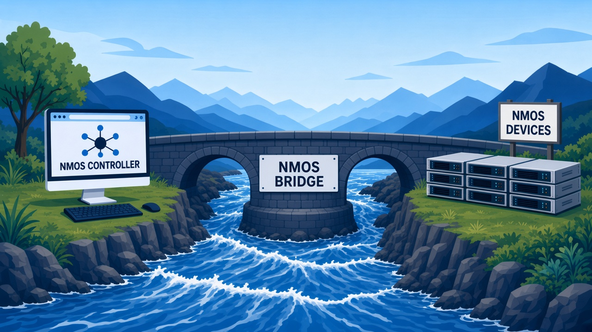

# NMOS Bridge

Provides browser-accessible proxy access to [AMWA IS-13](https://specs.amwa.tv/is-13/) Annotation APIs exposed by Nodes, and [AMWA IS-05](https://specs.amwa.tv/is-05/) Connection APIs, [AMWA IS-08](https://specs.amwa.tv/is-08/) Channel Mapping APIs, and [AMWA IS-12](https://specs.amwa.tv/is-12/) / [BCP-008](https://specs.amwa.tv/bcp-008-01/) Device Control Protocol (NCP) WebSockets exposed by Devices registered in an NMOS Registry, where the browser may not have network access to the Node service APIs and Device control APIs directly.



The bridge does not behave as an open proxy. Targets originate exclusively from registered Node `services` and Device `controls` entries; public requests use Node or Device IDs only and arbitrary URLs are forbidden. The Registry remains the source of truth and requires no changes.

## Public Bridge API

```text
/x-nmos-bridge/v1.0/nodes/{node_id}/{api}/{version}/{sub-path}
/x-nmos-bridge/v1.0/devices/{device_id}/{api}/{version}/{sub-path}
```

proxies to:

```text
{href}/{sub-path}
```

For Node paths, `href` is taken from the Node resource `services` entry matching
the service type for `{api}`. For example:

```text
PATCH /x-nmos-bridge/v1.0/nodes/{node_id}/annotation/v1.0/node/senders/{sender_id}
```

is proxied to:

```text
PATCH /x-nmos/annotation/v1.0/node/senders/{sender_id}
```

For Device paths, `href` is taken from the Device resource `controls` entry matching the control type for `{api}`:

| `{api}` | Control type | Device API |
| --- | --- | --- |
| `connection` | `urn:x-nmos:control:sr-ctrl/{version}` | IS-05 Connection |
| `channelmapping` | `urn:x-nmos:control:cm-ctrl/{version}` | IS-08 Channel Mapping |
| `ncp` | `urn:x-nmos:control:ncp/{version}` | IS-12 / BCP-008 NCP (WebSocket) |

`{api}` is the same path segment as in the advertised `href` (`/x-nmos/{api}/{version}`). The bridge API version (`v1.0`) is independent of the upstream API version (`{version}`).

For Connection (HTTP), the request:

```text
PATCH /x-nmos-bridge/v1.0/devices/{device_id}/connection/v1.1/single/receivers/{receiver_id}/staged
```

is proxied to `http://device.example.local` as:

```text
PATCH /x-nmos/connection/v1.1/single/receivers/{receiver_id}/staged
```

For Channel Mapping (HTTP), the request:

```text
POST /x-nmos-bridge/v1.0/devices/{device_id}/channelmapping/v1.0/map/activations/
```

is proxied to `http://device.example.local` as:

```text
POST /x-nmos/channelmapping/v1.0/map/activations/
```

Methods are restricted to `GET`, `HEAD`, `POST`, `PATCH`, `DELETE` and `OPTIONS`, the union of the methods the proxied Node service and Device control APIs use; which methods a given resource actually supports is up to the upstream API. Query strings, methods and request bodies are preserved. `GET` and `HEAD` requests may be retried; mutating methods are never automatically retried.

For NCP (WebSocket), the handshake:

```text
GET /x-nmos-bridge/v1.0/devices/{device_id}/ncp/{version}
Upgrade: websocket
Connection: Upgrade
```

is proxied to `http://device.example.local:7002` as:

```text
GET /x-nmos/ncp/{version}
Upgrade: websocket
Connection: Upgrade
```

(`http://device.example.local:7002` coming from the Device control `href`.) Upstream schemes are `ws` only for now (parallel to HTTP-only Connection and Channel Mapping). Envoy uses TCP health checks for NCP clusters (HTTP probes return `426` Upgrade Required on nmos-cpp's NCP port so a standard HTTP health check doesn't work).

`GET /x-nmos-bridge` and `GET /x-nmos-bridge/v1.0` return listings (`["v1.0/"]` and `["nodes/","devices/","query/"]`). Nodes and Devices are not listed; the Registry remains the source of truth for which resources exist. Given a Node ID, `GET …/nodes/{node_id}` lists the proxied APIs (currently `["annotation/"]`). Given a Device ID, `GET …/devices/{device_id}` lists the APIs proxied for that Device (e.g. `["channelmapping/","connection/"]`). `GET …/{collection}/{id}/{api}` lists the versions, so a client can see what became a bridge target without inspecting Envoy configuration.

Query subscription WebSockets use a canonical bridge path (nmos-cpp `ws_href` path shape). The handshake:

```text
GET /x-nmos-bridge/v1.0/query/{version}/subscriptions/{id}
Upgrade: websocket
Connection: Upgrade
```

is proxied to the Registry Query API WebSocket listener as:

```text
GET /x-nmos/query/{version}/subscriptions/{id}
Upgrade: websocket
Connection: Upgrade
```

Bridge-aware clients build that URL from the Bridge API origin, Query version, and subscription `id`; they do not open the absolute `ws_href` from the subscription resource when using the bridge as the browser-facing proxy. Query **HTTP** remains on `/x-nmos/query/...` (optional convenience).

Every other path under `/x-nmos-bridge`, including other bridge API versions and a version or API that is not a target for that Node or Device, returns `404` with an NMOS error body, so nothing in the bridge namespace falls through to the optional app route on `/`.

## Architecture

```text
Browser
    |
    +--(HTTP / WebSocket)------> Registry Query API (when reachable directly)
    |
    +--(HTTP / WebSocket)------> Envoy
                                    |
                                    +--> /x-nmos-bridge/nodes/... --> Node service APIs
                                    |
                                    +--> /x-nmos-bridge/devices/... --> Device control APIs
                                    |         (HTTP Connection / Channel Mapping;
                                    |          WebSocket NCP)
                                    |
                                    +--> /x-nmos-bridge/query/.../subscriptions/{id}
                                    |         --(WebSocket)--> Registry Query API
                                    |
                                    +--> /x-nmos -> ["query/"] (fixed listing)
                                    |
                                    +--> /x-nmos/query/... (HTTP convenience)
                                    |         --> Registry Query API
                                    |
                                    +--> /x-dns-sd/... (convenience)
                                    |         --> Registry DNS-SD API
                                    |
                                    +--> /log/... (convenience)
                                    |         --> Registry Logging API
                                    |
                                    +--> /... (optional) --> nmos-js app

Adapter (server-side; not on the browser path)
    |
    +--(HTTP / WebSocket)------> Registry Query API (Node and Device discovery)
```

The NMOS Bridge consists of Envoy and the adapter service:

- **Envoy** proxies browser access to supported Node service and Device control APIs on `/x-nmos-bridge/...` (required for the bridge), and Query subscription WebSockets on `/x-nmos-bridge/v1.0/query/...` (rewritten to the Registry Query API WebSocket path). It may also proxy Query **HTTP** on `/x-nmos/query/...`, DNS-SD on `/x-dns-sd/...`, and the nmos-js app on `/` as optional convenience. `GET /x-nmos/` returns a fixed listing of `["query/"]` so discovery matches what is actually proxied. Node service and Device control APIs are only exposed under `/x-nmos-bridge`; their direct `/x-nmos/...` paths are not proxied. Other `/x-nmos/` APIs (Registration, Node, …) are not proxied — they may use different ports. Envoy applies routing, request size limits, timeouts, retry policy, health checking and failover, and access logging of mutating requests.
- **The adapter** (`adapter/`) converts Registry state into Envoy configuration. It tracks Nodes and Devices through separate [Query API WebSocket subscriptions](https://specs.amwa.tv/is-04/branches/v1.3.x/docs/4.2._Behaviour_-_Querying.html) (non-persistent, `resource_path` `/nodes` and `/devices`), extracts Node services and Device controls, and generates Envoy routes and clusters, atomically replacing the dynamic configuration files (`rds.json`, `cds.json`) which Envoy reloads via filesystem watch. The adapter does not proxy traffic and does not determine runtime health.

    On connecting, the Registry sends a sync of all current Nodes and Devices, then pushes added, modified and removed events on the corresponding subscription; the adapter rebuilds configuration on each change. If either connection is interrupted, the adapter resubscribes with exponential backoff and the fresh sync re-establishes that resource set, including resources that were removed while disconnected. The last good configuration keeps being served until the new sync arrives.

### Mapping

Each unique combination of Node or Device ID, API and version is a separate bridge target, producing one route and one cluster with deterministic names:

```text
nmos_bridge_node_{safe_node_id}_{api}_{safe_version}
nmos_bridge_device_{safe_device_id}_{api}_{safe_version}
```

where characters outside `[A-Za-z0-9_]` are replaced by `_` (e.g. `v1.1` becomes `v1_1`). Separate resources, APIs and versions are never merged: a `v1.0` route cannot fail over to a `v1.1` href, and one API cannot fail over to another even when they are advertised at the same host and port.

If multiple eligible hrefs exist for the same Node or Device and version, they become candidates of a single cluster, prioritized as:

```text
priority 0: private IP address hrefs
priority 1: private DNS hrefs
priority 2: other hrefs
```

Envoy health checks the candidates and fails over from higher to lower priority when the preferred candidates become unhealthy.

Services and controls that are not safe to proxy are logged and ignored: missing or malformed hrefs, unsupported schemes (Annotation, Connection, and Channel Mapping support `http`; NCP supports `ws`), hrefs whose path is inconsistent with the advertised version, and duplicates after normalization.

## Testing

Location rewrite policy is covered by Lua unit tests (Lua 5.1 / LuaJIT, matching Envoy). From `envoy/`:

```bash
lua5.1 location_rewrite_test.lua
lua5.1 location_rewrite_test.lua -v   # per-case status lines
```

Adapter target and route generation is covered by unit tests. From `adapter/`:

```bash
npm test
```

## Running

`docker-compose.yml` is an example, not a working default: **always** set `REGISTRY_QUERY_URL`
to a Query API the adapter (and Envoy's `/x-nmos/query/` routes) can reach. The
sample `http://registry:8870/...` only works if a service named `registry` is on
this Compose network. A Registry on the Docker host needs a reachable hostname
(see commented `host.docker.internal` / `extra_hosts` in the file) and often
`REGISTRY_QUERY_WS_URL` when the advertised Query `ws_href` is not reachable
from the containers.

`APP_URL` is optional. Set it only if Envoy should serve the UI; leave it unset
when nmos-js is opened on its own origin (for example `yarn start` on port 3000).

```bash
docker compose up --build
```

Environment variables (compose `environment:` or the process environment):

| Variable | Description | Default |
| --- | --- | --- |
| `REGISTRY_QUERY_URL` | Query API URL used by the adapter for Node and Device discovery; its host and port are the upstream for Envoy's `/x-nmos/query/` routes (and `/x-dns-sd/` / `/log/` when the corresponding override is unset). The path in this URL is not used for proxying. | (required) |
| `REGISTRY_DNS_SD_URL` | optional upstream for Envoy's `/x-dns-sd/` routes when DNS-SD is not on the same host/port as `REGISTRY_QUERY_URL` | (same as Query) |
| `REGISTRY_LOGGING_URL` | optional upstream for Envoy's `/log/` routes when Logging is not on the same host/port as `REGISTRY_QUERY_URL` | (same as Query) |
| `APP_URL` | upstream for Envoy's catch-all `/` route (standalone nmos-js at `/`, or a Registry that serves the UI under `/admin`); if unset, no application route is configured | (none) |
| `ROUTE_TIMEOUT_SECONDS` | upstream request timeout | `15` |
| `MAX_UPDATE_RATE_MS` | subscription `max_update_rate_ms` (event coalescing) | `100` |
| `RECONNECT_MIN_MS` | initial WebSocket reconnect backoff | `1000` |
| `RECONNECT_MAX_MS` | maximum WebSocket reconnect backoff | `30000` |
| `REGISTRY_QUERY_WS_URL` | WebSocket scheme and authority to use instead of those in the subscription `ws_href`; the advertised subscription path is preserved; an omitted port means the scheme default | (none) |
| `OUTPUT_DIR` | where dynamic Envoy configuration is written | `/etc/envoy/dynamic` |

Envoy listens on port 8080 and routes:

- `/x-nmos` and `/x-nmos/` return a fixed IS-04-style listing of `["query/"]` (only what this Envoy instance proxies)
- `/x-nmos/query/...` to the Registry Query API (convenience; see Deployment)
- `/x-dns-sd/...` to the Registry DNS-SD / MDNS API (convenience; same upstream as Query unless `REGISTRY_DNS_SD_URL` is set)
- `/log/...` to the Registry Logging API (convenience; same upstream as Query unless `REGISTRY_LOGGING_URL` is set)
- everything else to the nmos-js app (or Registry UI), if `APP_URL` is set

## Deployment

The bridge itself only requires browser HTTP access to
`/x-nmos-bridge/v1.0/...` on Envoy. Proxying Query HTTP on `/x-nmos/query/...`,
DNS-SD on `/x-dns-sd/...`, and Logging on `/log/...` is convenience (one
browser-facing HTTP origin when the SPA is also served via `APP_URL`, or when
those SPA settings point at Envoy). Registration, Node, and other non-Query
`/x-nmos/` APIs are not proxied; `GET /x-nmos/` therefore lists only `query/`,
rather than reflecting the Registry's full `/x-nmos/` catalogue. By default
`/x-dns-sd/` and `/log/` use the same upstream host and port as
`REGISTRY_QUERY_URL`; set `REGISTRY_DNS_SD_URL` or `REGISTRY_LOGGING_URL` when
those APIs listen elsewhere (for example a different `mdns_port` or
`logging_port`).

`APP_URL` may be a standalone nmos-js host (SPA at `/`) or a Registry that
serves the UI under `/admin` (nmos-cpp-registry). In both cases Envoy's `/log/`
route supports the SPA Logging API default (`{origin}/log/v1.0`).

Configure nmos-js **NMOS Bridge API** to the bridge base, for example:

```text
http://controller.example.com:8080/x-nmos-bridge/v1.0
```

The default (when unset in config or Settings) is this page's origin plus
`/x-nmos-bridge/v1.0`.

A layout that also proxies Query and Logging through Envoy might use:

```text
Query API:              http://controller.example.com:8080/x-nmos/query/v1.3
Logging API:            http://controller.example.com:8080/log/v1.0
NMOS Bridge API:        http://controller.example.com:8080/x-nmos-bridge/v1.0
```

Query API WebSocket subscriptions for **bridge-aware** clients use `/x-nmos-bridge/v1.0/query/{version}/subscriptions/{id}` through Envoy (static path rewrite to the Registry Query API WebSocket listener). The subscription resource's absolute `ws_href` is unchanged and still names the Registry; clients that only follow `ws_href` need to reach that listener. The adapter's server-side subscription is separate: it must reach the Query API and the WebSocket URL from the subscription response. Set `REGISTRY_QUERY_WS_URL` when the advertised `ws_href` uses a scheme, host name or port which is not reachable from the adapter (and from Envoy), for example `ws://192.168.6.101:81`. That override is also the upstream for the browser-facing Query subscription WebSocket route.

WebSocket routes use `timeout: 0s` and `WS_IDLE_TIMEOUT_SECONDS` (default `3600`) so long-lived grains are not cut by `ROUTE_TIMEOUT_SECONDS`.

Envoy must be able to reach every Node service and Device control API `href`
which is to be used through the bridge. This is independent of browser
reachability: the purpose of the bridge is to place Envoy on the Node and
Device networks when the browser cannot access those networks directly.
Configure the container or host networking and any firewall policy
accordingly.

The included Compose file uses a shared volume for dynamic configuration.
The adapter writes configuration into the volume and Envoy watches it for
changes. Keep one adapter and one Envoy instance together when using this
file-based arrangement. A deployment with independently scaled Envoy
instances would require an xDS control plane, which is not currently
implemented.

If nmos-js is served separately, set Query API, Logging API and NMOS Bridge
API as needed (Registry and/or Envoy). Alternatively, set `APP_URL`
and use Envoy as a single origin for nmos-js, Query/DNS-SD/Logging APIs, and
the bridge.

### Container Orchestration

The same adapter and Envoy arrangement can be deployed as containers sharing
a writable configuration volume. In Kubernetes, they can run as containers
in one Pod with an `emptyDir` volume. The Pod needs network interfaces and
routes which can reach the Node service and Device control API addresses; this
may require secondary networking in deployments where media devices are
outside the cluster network. Kubernetes and OpenShift manifests are
deployment-specific and are not included here.

## Browser Application Behavior

The nmos-js client offers a **NMOS Bridge Mode** and a separate
**NMOS Bridge API**. The same mode applies to supported Node service and Device
control API fetches:

- **No Bridge** (default): use advertised Node service and Device control hrefs directly, never the bridge.
- **Auto Bridge**: the preferred access sequence. Use the advertised href directly; if inaccessible, use the bridge URL; cache the successful access path per Node or Device. Note that on first access to a Node or Device that is not directly reachable, the browser must wait for the direct attempt to fail (up to 5 seconds) before falling back; the cached path avoids this on subsequent accesses.
- **Forced Bridge**: always use the bridge, skipping direct attempts entirely. Useful when it is known that no Node or Device is reachable from the browser.

`POST`, `PATCH` and `DELETE` requests are not automatically retried via alternate paths; they follow whichever path was resolved during discovery. Bridge requests use the configured NMOS Bridge API (default: SPA origin + `/x-nmos-bridge/v1.0`).

IS-12 Browser launch (`?uri=`) uses the Device NCP `href` under No Bridge and Auto Bridge. Under **Forced Bridge**, the launch `uri` is the bridge NCP WebSocket URL (`ws`/`wss` on the Bridge API origin, path `…/devices/{id}/ncp/{version}`).

## Status

Phase 1 is implemented, plus health checking and multi-endpoint failover from Phase 2:

- HTTP browser and upstream access, file-based dynamic configuration
- `GET`/`HEAD`/`POST`/`PATCH`/`DELETE`
- Upstream 3xx `Location` handling (see below)
- Node service APIs on `/x-nmos-bridge/.../nodes/{id}/...`
- Query subscription WebSockets on `/x-nmos-bridge/v1.0/query/...` (static rewrite to the Registry Query API WebSocket listener)
- Device NCP WebSockets on `/x-nmos-bridge/.../ncp/...` (Forced Bridge remaps IS-12 Browser launch)

Not yet implemented: response size limits, HTTPS upstreams, authentication translation, mTLS, and an xDS control plane.

`Location` handling uses each target's `base_path` (the path of the Node service or Device control `href`, typically `/x-nmos/annotation/v1.0`, `/x-nmos/connection/v1.1`, `/x-nmos/channelmapping/v1.0` or similar):

- Absolute or scheme-relative (filled with the client scheme) Locations whose scheme and authority match a candidate for that target and whose path stays under that `base_path` are rewritten onto the bridge; other absolute Locations are forwarded unchanged (including candidate URLs outside `base_path`, e.g. `http://device/x-manifest/...`).
- Path-relative and root-relative Locations are resolved against the upstream API path and rewritten onto the bridge when they stay under `base_path`; relatives outside `base_path` are rejected with `502` and an NMOS error body (`x-nmos-bridge-error` describes the unsupported Location), since an absolute upstream URL cannot be reconstructed without knowing which candidate Envoy selected.
- Envoy internal redirects are not used: absolute Node or Device Locations under `/x-nmos/` would be matched by path (e.g. `/x-nmos/query/` onto the Query cluster) rather than treated as bridge targets.
